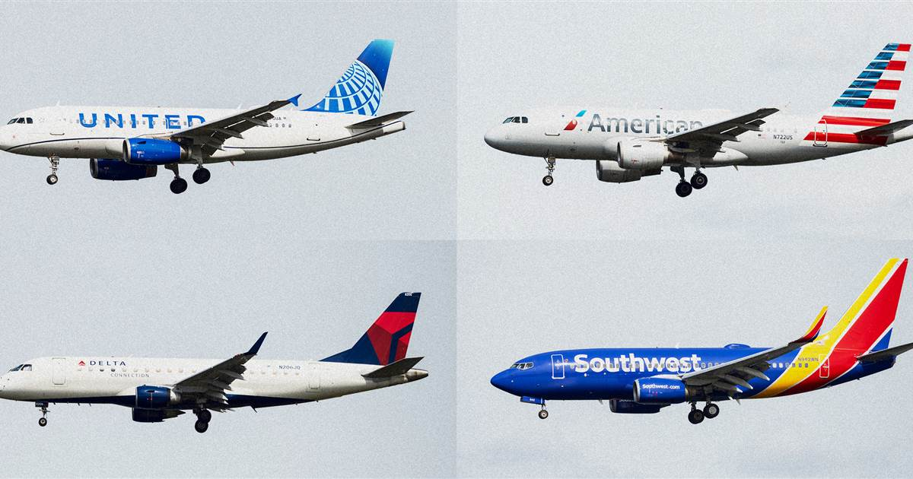

```{r setup, include=FALSE}
knitr::opts_chunk$set(
  message = FALSE,
  echo = TRUE
)
library(tidyverse)
library(sds192)
library(nycflights13)
library(ggplot2)

```


## Introduction
Travel can be stressful under any circumstances, and flight delays can make it even worse. Flights may be delayed for a variety of reasons, including weather and air traffic, but sometimes they result from errors by the airline carrier. In our project, we show variation in the length of departure delays for flights out of the three major New York City airports (EWR, LGA, and JFK) on the first day of every month in 2013. To make the data from the nycflights13 package more manageable, we include only flights from the top four domestic airline carriers: American (AA), Delta (DL), United (UA), and Southwest (WN).

 

In general, we found that most flight delays are short. However, our graphic does suggest some variation in length of departure delays between airlines and throughout the year. Information about trends in departure delays by carrier and month has the potential to help travelers, including students like us, know what to expect or even determine what airline to fly with once the pandemic is over. 


## Data Graphic
```{r, warning=FALSE}
new_flights <- filter(flights, day == "1", carrier=="UA"| carrier=="DL" | carrier=="AA" |carrier=="WN")
new_flights$month <- factor(new_flights$month)

ggplot(data = new_flights, aes(x=month, y=dep_delay, color = carrier))+
  ylim(0,400)+
  geom_boxplot()+
  scale_x_discrete(limits=c("1","2","3","4","5","6","7","8","9","10","11","12"))+
  facet_wrap(~carrier)+
  ggtitle(label = "Flight Delays by Airline Carrier",subtitle = "Departure Delays on the first day of every month in 2013")+
  theme(legend.position = "none")+
  xlab(label = "Month")+
  ylab(label = "Departure Delay(minutes)")
```

## Graph Caption
The y-axis represents the departure delay in minutes while the x-axis represents the month (labeled numerically) in which the flight took place. To determine which airlines and months have the worst departure delays, one can look at the plots which are higher up on each chart, as higher plots indicate longer delays. We chose to use box plots as they helped us represent the median departure delay, represented by the horizontal line in the middle of each box as well as outliers, represented by individual points. From the box plot, we can interpret that most of the departure delays, regardless of carrier or time of year, were small. The size and position of the boxes show the variation in the lengths of the middle portion of delays. Some carriers seem to have more variation in length of departure delay than others (American as compared to Delta, for example) and all four carriers have taller boxes and greater variation in delay length during July and August. From the outliers, we can see that delays were rarely long. For example, an American Airlines flight in January 2013 was delayed by roughly 300 minutes, or five hours. We note that we removed one extreme outlier for a Delta flight to make the graph easier to read.  


## Sources
- <https://t-redactyl.io/blog/2016/04/creating-plots-in-r-using-ggplot2-part-10-boxplots.html>[link](https://t-redactyl.io/blog/2016/04/creating-plots-in-r-using-ggplot2-part-10-boxplots.html)
- <https://www.bts.gov/newsroom/january-2013-us-airline-system-passengers-16-january-2012>[link](https://www.bts.gov/newsroom/january-2013-us-airline-system-passengers-16-january-2012)
- <https://www.today.com/money/airlines-update-mileage-programs-response-covid-19-t184592>[link](https://www.today.com/money/airlines-update-mileage-programs-response-covid-19-t184592)
- <https://parksleepfly.com/blog/how-to-avoid-flight-delays/>[link](https://parksleepfly.com/blog/how-to-avoid-flight-delays/)

## Word count

```{r word_count, message=FALSE, echo=FALSE}
text_stats()
```

## Standards

In this assignment, we attempted the following [standards](https://beanumber.github.io/sds192/standards.html):

- `r standard_button("markdown")`: We mastered the Markdown standard because our blog post compiles all necessary data, is clean and simplified, and contains no error or loading messages. In addition, we applied a variety of web elements such as headers, code chunks, links, data graphics, and images to our blog post.

- `r standard_button("aesthetics")`: We mastered the Aesthetics standard because we used faceting to differentiate between airline carriers, position to indicate delay length and when delays happened, and geom_boxplot() to give information about the distribution of delay lengths. We also utilized visual cues such as color hue and aligned length to differentiate between airline carriers and provide context to the data respectively.

- `r standard_button("context")`:  We met the Context standard because we have appropriate axis labels which include units of measurement coupled with an informative title and descriptive subtitle.

